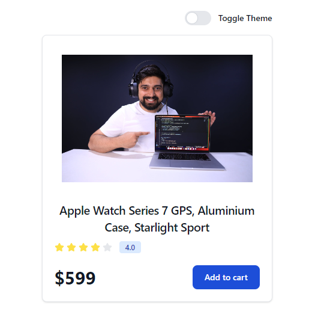

# Theme ContextAPI

We are using the context API functionality with the `tailwind.css` to create the Theme toggle to enable the light and dark mode.

- For better understanding of the data flow inside the application, please see the file in a order of

1. theme.js
2. ThemeBtn.jsx
3. App.jsx

- All other file are as helper file for creating the project.

## Dark Mode

## Light Mode

- Pull the whole Project and see the Magic !!
